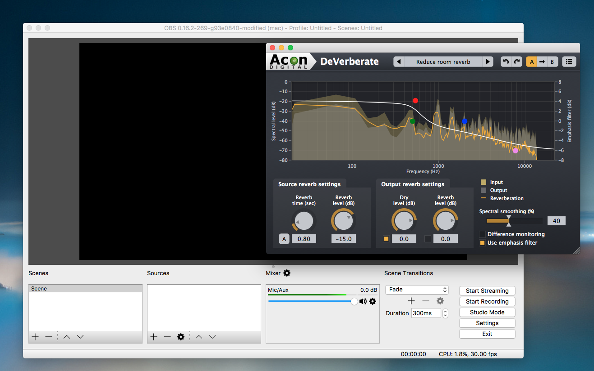

# OBS-VST
Use VST 2.x plugins as audio filters in OBS.

## Research
### Sites
*  http://teragonaudio.com/article/How-to-make-your-own-VST-host.html
*  http://www.reaper.fm/sdk/vst/vst_ext.php
*  https://forum.juce.com/t/mac-64-bit/6295/5
*  https://gist.github.com/t-mat/206e3e7dfc3f89421bc1
*  https://github.com/audacity/audacity/blob/17afc51644b2b327e173a23d6066dde598838c03/src/effects/VST/aeffectx.h

### Info
> In general VST 2.4 is platform independent. There are only three platform
  dependent opcodes :  
  effEditOpen  
  audioMasterGetDirectory  
  audioMasterOpenFileSelector
> 
> Here are the required API changes for 64 bit Mac OS X:
>
> effEditOpen:  
  the [ptr] argument is a WindowRef on 32 bit Mac.  
  On 64 bit this is a NSView pointer. The plug-in needs to add its own NSView as
  subview of it.
>
> audioMasterGetDirectory:  
  the [return value] is a FSSpec on 32 bit Mac.  
  On 64 bit this is a char pointer pointing to an UTF-8 encoded string.
>
> audioMasterOpenFileSelector:  
  the VstFileSelect struct uses FSSpec's on 32 bit Mac.  
  On 64 bit Mac these are char pointers pointing to UTF-8 encoded strings.
